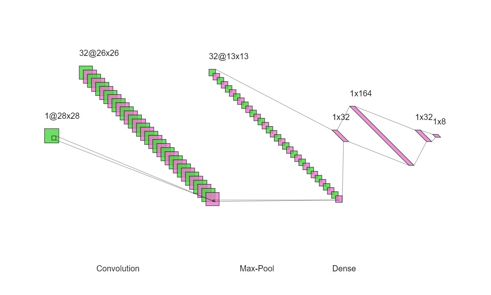
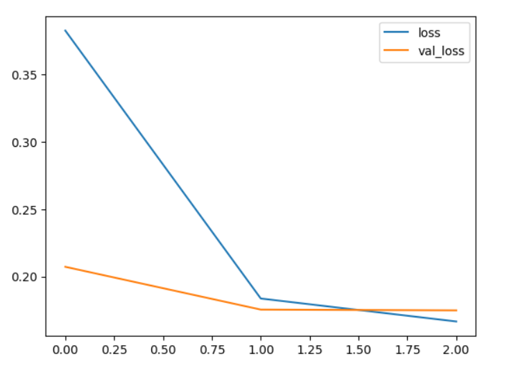
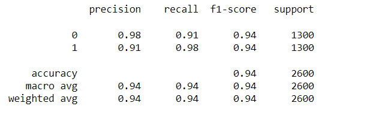
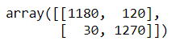
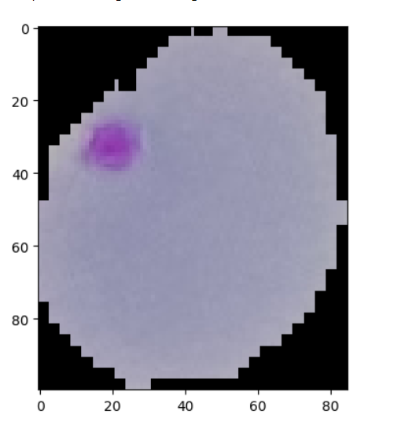

# Deep Neural Network for Malaria Infected Cell Recognition

## AIM

To develop a deep neural network for Malaria infected cell recognition and to analyze the performance.

## Problem Statement and Dataset
The goal is to create an algorithm that can detect malaria-infected cells in blood samples using deep learning techniques.To develop a model that can accurately identify infected cells and distinguish them from healthy ones. The performance of the model will be evaluated based on its accuracy, precision, recall, and F1 score. This problem statement is important because it can help improve the diagnosis of malaria and reduce the time and cost associated with manual diagnosis.

Malaria dataset of 27,558 cell images with an equal number of parasitized and uninfected cells. A level-set based algorithm was applied to detect and segment the red blood cells. The images were collected and annotated by medical professionals.Here we build a convolutional neural network model 

## Neural Network Model



## DESIGN STEPS

### STEP 1:
Import tensorflow and preprocessing libraries

### STEP 2:
Download and load the dataset folder

### STEP 3:
Split the training and testing folders.

###  STEP 4:
Perform image data generation methods.

###  STEP-5:
Build the convolutional neural network model

###  STEP-6:
Train the model with the training data

###  STEP-7:
Plot the performance plot

###  STEP-8:
Evaluate the model with the testing data using probability prediction(uninfected-> prob>0.5,parasitized-> <=0.5)

###  STEP-9:
Fit the model and predict the sample input.


## PROGRAM

### Name: Easwari M

### Register Number: 212223240033

```
DEVELOPED BY: Easwari M
REGISTER NUMBER: 212223240033
```

```
import os
import pandas as pd
import numpy as np
import seaborn as sns
import matplotlib.pyplot as plt
from matplotlib.image import imread
from tensorflow.keras.preprocessing.image import ImageDataGenerator
from tensorflow import keras
from tensorflow.keras import layers
from tensorflow.keras import utils
from tensorflow.keras import models
from sklearn.metrics import classification_report,confusion_matrix
import tensorflow as tf
# to share the GPU resources for multiple sessions
from tensorflow.compat.v1.keras.backend import set_session
config = tf.compat.v1.ConfigProto()
config.gpu_options.allow_growth = True # dynamically grow the memory used on the GPU
config.log_device_placement = True # to log device placement (on which device the operation ran)
sess = tf.compat.v1.Session(config=config)
set_session(sess)

%matplotlib inline

os.listdir(my_data_dir)

test_path = my_data_dir+'/test/'
train_path = my_data_dir+'/train/'

os.listdir(train_path)

len(os.listdir(train_path+'/uninfected/'))


len(os.listdir(train_path+'/parasitized/'))

os.listdir(train_path+'/parasitized')[0]

para_img= imread(train_path+
                 '/parasitized/'+
                 os.listdir(train_path+'/parasitized')[0])

plt.imshow(para_img)

dim1 = []
dim2 = []
for image_filename in os.listdir(test_path+'/uninfected'):
    img = imread(test_path+'/uninfected'+'/'+image_filename)
    d1,d2,colors = img.shape
    dim1.append(d1)
    dim2.append(d2)

sns.jointplot(x=dim1,y=dim2)


image_shape = (130,130,3)

help(ImageDataGenerator)


image_gen = ImageDataGenerator(rotation_range=20, 
                               width_shift_range=0.10, 
                               height_shift_range=0.10, 
                               rescale=1/255, 
                               shear_range=0.1,
                               zoom_range=0.1, 
                               horizontal_flip=True, 
                               fill_mode='nearest' 
                              )

image_gen.flow_from_directory(train_path)

image_gen.flow_from_directory(test_path)


classifier = keras.Sequential()
c1=layers.Conv2D(filters=32,kernel_size=(3,3),input_shape=image_shape,activation='relu')
classifier.add(c1)
c2=layers.MaxPool2D(pool_size=(2,2))
classifier.add(c2)
c3=layers.Conv2D(filters=32,kernel_size=(3,3),input_shape=image_shape,activation='relu')
classifier.add(c3)
c4=layers.MaxPool2D(pool_size=(2,2))
classifier.add(c4)
c5=layers.Conv2D(filters=32,kernel_size=(3,3),input_shape=image_shape,activation='relu')
classifier.add(c5)
c6=layers.MaxPool2D(pool_size=(2,2))
classifier.add(c6)
c7=layers.Flatten()
classifier.add(c7)
c8=layers.Dense(32,activation='relu')
classifier.add(c8)
c9=layers.Dense(32,activation='relu')
classifier.add(c9)
c10=layers.Dense(1,activation='sigmoid')
classifier.add(c10)

classifier.compile(loss='binary_crossentropy',
              optimizer='adam',
              metrics=['accuracy'])


classifier.summary()

batch_size = 16


help(image_gen.flow_from_directory)

train_image_gen = image_gen.flow_from_directory(train_path,
                                               target_size=image_shape[:2],
                                                color_mode='rgb',
                                               batch_size=batch_size,
                                               class_mode='binary')


train_image_gen.batch_size

len(train_image_gen.classes)


train_image_gen.total_batches_seen


test_image_gen = image_gen.flow_from_directory(test_path,
                                               target_size=image_shape[:2],
                                               color_mode='rgb',
                                               batch_size=batch_size,
                                               class_mode='binary',shuffle=False)


train_image_gen.class_indices


results = classifier.fit(train_image_gen,epochs=20,
                              validation_data=test_image_gen
                             )

classifier.save('cell_model.h5')


losses = pd.DataFrame(classifier.history.history)

losses[['loss','val_loss']].plot()


classifier.metrics_names

classifier.evaluate(test_image_gen)

pred_probabilities = classifier.predict(test_image_gen)

test_image_gen.classes

predictions = pred_probabilities > 0.5


print(classification_report(test_image_gen.classes,predictions))

confusion_matrix(test_image_gen.classes,predictions)

```

## OUTPUT

### Training Loss, Validation Loss Vs Iteration Plot



### Classification Report



### Confusion Matrix



### New Sample Data Prediction



## RESULT

Thus, a deep neural network for Malaria infected cell recognition is successfully developed.